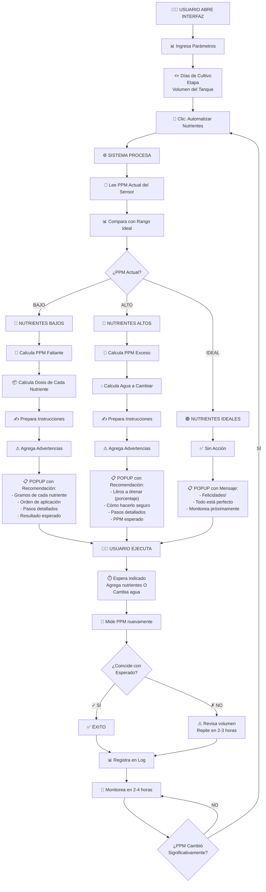
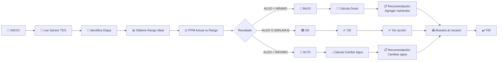

---

# 📊 DIAGRAMA DE DECISIÓN



---

# 🔄 CICLO DE OPERACIÓN DIARIA

```mermaid
timeline
    title Ciclo Típico Diario de Monitoreo
    
    6:00 : Revisa Dashboard 📊
    6:15 : Primer cálculo automático
    6:30 : Ejecuta acción si es necesario
    
    12:00 : Segunda revisión
    12:15 : Cálculo automático
    12:30 : Ejecuta acción si es necesario
    
    18:00 : Tercera revisión  
    18:15 : Cálculo automático
    18:30 : Ejecuta acción si es necesario
    
    23:00 : Revisión nocturna rápida
    23:15 : Verifica sensores
```

---

# 📈 CAMBIOS DE PPM TÍPICOS

```
Antes y después del cálculo automático:

AGREGAR NUTRIENTES:
  350 ppm ──[+100 ppm]──> 450 ppm
           (5 minutos)
           
  La función calcula:
  ✓ Qué agregar exactamente
  ✓ En qué orden
  ✓ Cuánto esperar
  
---

CAMBIAR AGUA:
  1150 ppm ──[cambio 30%]──> 805 ppm
           (5 minutos)
           
  La función calcula:
  ✓ Cuánta agua drenar (30% = 30L de 100L)
  ✓ Cómo hacerlo sin shock
  ✓ PPM esperado
```

---

# 🎯 MATRIZ DE DECISIÓN

| PPM Actual | Rango Ideal | Estado | Acción |
|-----------|------------|--------|--------|
| 200 | 400-800 | 🔴 Bajo | Agregar nutrientes |
| 350 | 400-800 | 🔴 Bajo | Agregar nutrientes |
| 450 | 400-800 | 🟢 OK | Monitorear |
| 600 | 400-800 | 🟢 OK | Monitorear |
| 750 | 400-800 | 🟢 OK | Monitorear |
| 850 | 400-800 | 🔴 Alto | Cambiar agua |
| 1000 | 400-800 | 🔴 Alto | Cambiar agua |
| 1200 | 400-800 | 🔴 Alto | Cambiar agua |

---

# 🔐 LÍMITES DE SEGURIDAD

```
MAX AGREGAR EN UNA DOSIS:
  200 ppm
  └─> Si necesita más, divide en 2-3 aplicaciones

MAX CAMBIAR AGUA EN UNA VEZ:
  50% del tanque
  └─> Si necesita más, divide en 2 cambios

TIEMPO ENTRE NUTRIENTES:
  10 minutos (para evitar picos)

TIEMPO ENTRE DOSIS:
  1-2 horas (para observar plantas)

TEMPERATURA AGUA:
  18-24°C ideal
  └─> >25°C favorece problemas de raíz
```

---

Estos diagramas muestran visualmente cómo el sistema:
1. Lee el sensor
2. Compara con rangos ideales
3. Decide la acción
4. Calcula exactamente qué hacer
5. Instruye al usuario
6. Se cicla continuamente

El proceso es **automático, seguro y preciso**.
